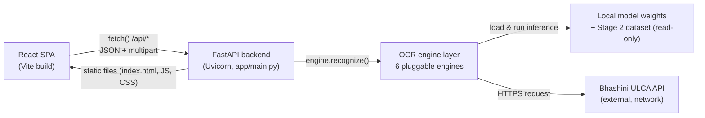
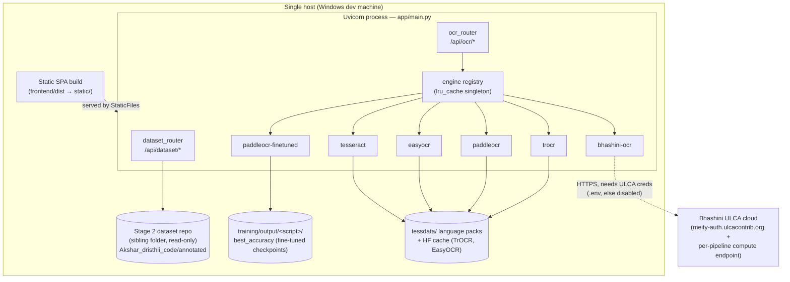
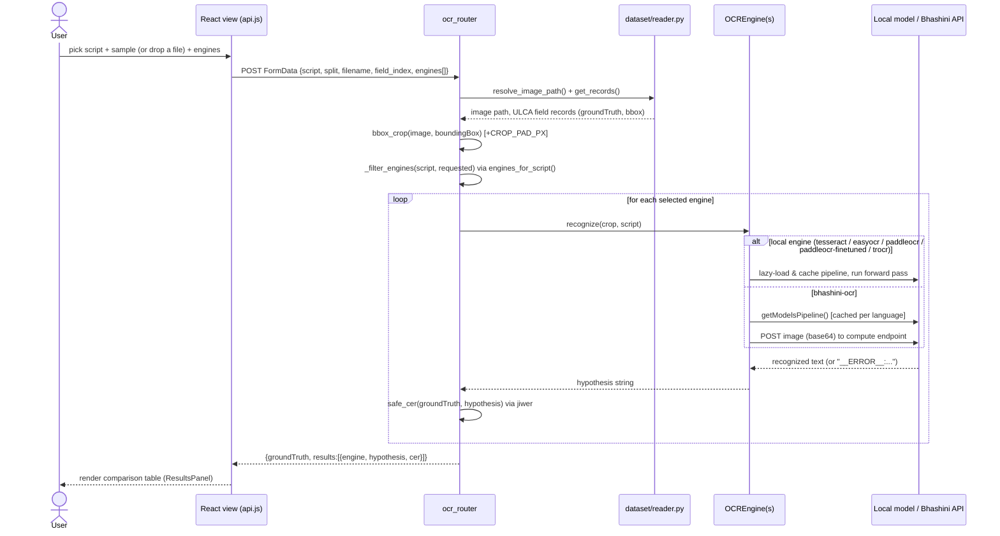
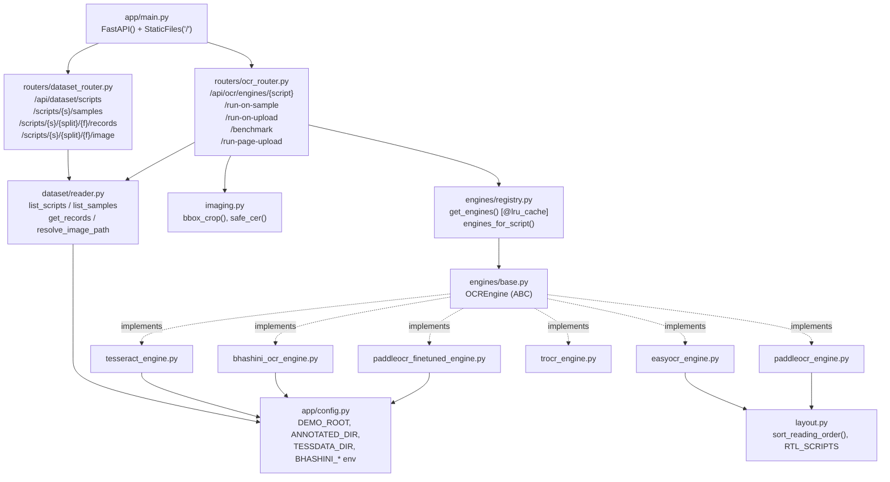
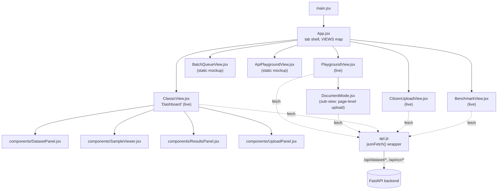
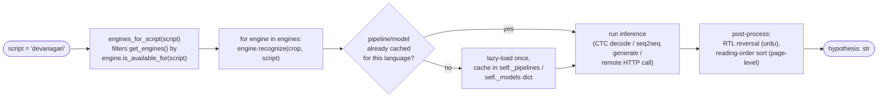
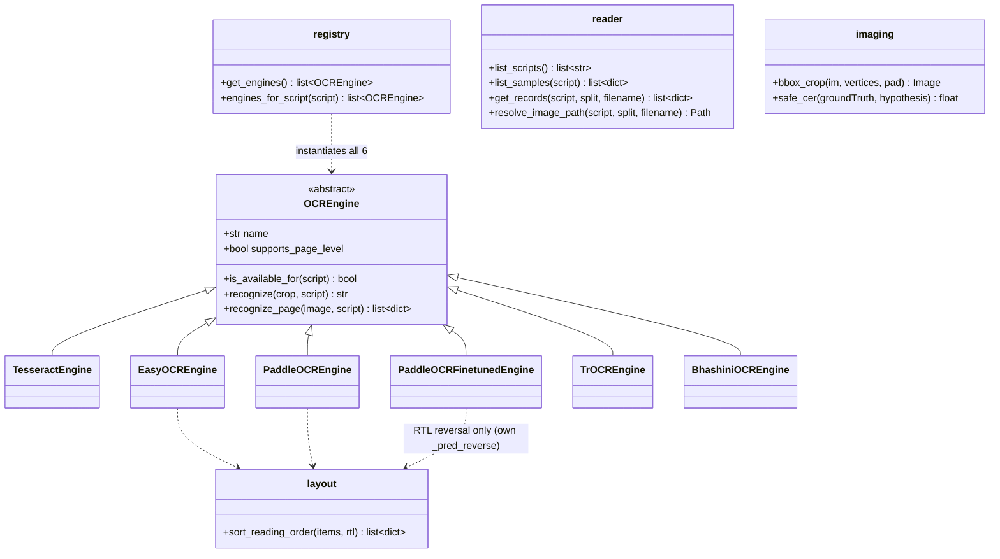

# AksharDrishti Demo — Architecture

This document is the source of truth for how the Stage 3 demo (`demo/`) is put
together: a React frontend, a FastAPI backend, and six pluggable OCR engines
(five local models, one remote API) benchmarked against the Stage 2 annotated
dataset. Diagrams are written in [Mermaid](https://mermaid.js.org/), so they
render inline on GitHub/GitLab and in VS Code with the "Markdown Preview
Mermaid Support" extension — no separate image files to keep in sync.

Update this file in the same PR whenever a router, engine, or view is added,
renamed, or removed. If a diagram and the code disagree, the code wins —
fix the diagram.

---

## 1. High-level architecture

The demo has four layers: a browser SPA, a FastAPI server, a pluggable engine
layer, and the data each engine reads from (local model weights, the
read-only Stage 2 dataset, or Bhashini's cloud API).

---

## 2. System architecture

Everything except Bhashini runs on one machine as a single Uvicorn process.
The FastAPI app mounts two routers and then mounts the built frontend as
static files at `/`, so in production there is one process and one port.

---

## 3. Data flow — one OCR request end to end

This is what happens when a user runs OCR on a dataset sample or an upload
(`POST /api/ocr/run-on-sample` or `/run-on-upload`).

`run-on-upload` is the same flow minus the ground-truth lookup (no `reader`
call, no CER). `run-page-upload` is the page-level variant: it skips
`bbox_crop` entirely and calls `engine.recognize_page()` on engines where
`supports_page_level = True`, which run their own text detector and return
per-line `{bbox, text, confidence}` ordered by `layout.sort_reading_order()`.

---

## 4. Backend architecture

Design pattern worth keeping: **registry + abstract base class.** Every engine
implements the same three-method `OCREngine` interface
(`is_available_for`, `recognize`, optional `recognize_page`); routers only
ever talk to `engines_for_script()` / `_filter_engines()`. Adding engine #7
means one new file plus one line in `registry.py` — no router changes.

---

## 5. Frontend architecture

Six tabs, two different jobs:

- **Live views** (`PlaygroundView`, `ClassicView`, `CitizenUploadView`,
  `BenchmarkView`) call `api.js` → the real backend → real engines.
- **Static mockup views** (`BatchQueueView`, `ApiPlaygroundView`) render fixed
  demo data from `demoScreens.css` / inline markup only — no `fetch` calls.
  They exist to pitch product surfaces (a review queue, a developer console)
  that don't have a backend yet. Don't mistake their absence of a network
  tab for a bug.

---

## 6. ML ↔ backend connection (engine dispatch in detail)

How a script name turns into a running model and back into text.

The lazy-cache-per-language pattern (`self._pipelines`, `self._readers`,
`self._models`, `self._predictors` — same idea, different dict name in each
engine) exists because loading a model is expensive and must never happen at
import time or on every request — only once per language, on first use.
`registry.get_engines()` itself is wrapped in `@lru_cache(maxsize=1)` for the
same reason: one engine instance per process, not one per request.

---

## 7. Engines reference

| Engine (`name`) | Type | Runtime / library | Model | Scripts (10 total) | Page-level? |
|---|---|---|---|---|---|
| `tesseract` | Local, CPU | `pytesseract` → Tesseract-OCR binary | `tessdata_best` language packs | hi, bn, ta, ur, gu, kn, ml, or, pa, te | No |
| `easyocr` | Local, GPU (falls back CPU) | `easyocr.Reader` | EasyOCR's bundled detector+recognizer | hi, bn, ta, ur, kn, te (6/10 — no gu/ml/or/pa) | **Yes** |
| `paddleocr` | Local, GPU→CPU fallback | PaddleOCR PP-OCRv5 pipeline | Official PP-OCRv5 multilingual `rec` models | hi (devanagari), ta only — the only 2 scripts with an official PP-OCRv5 checkpoint | **Yes** |
| `paddleocr-finetuned` | Local, CPU only | PaddleOCR `TextRecognition` (recognition-only, no detector) | **Our own fine-tunes**, `training/output/<script>/best_accuracy/inference` (8 scripts fine-tuned from the Devanagari/Arabic backbone as a generic Indic-abugida base where no official checkpoint exists) | devanagari, tamil, telugu, urdu, bengali, gujarati, kannada, malayalam, odia, punjabi | No |
| `trocr` | Local, GPU→CPU fallback | HF `transformers` `VisionEncoderDecoderModel` | Community fine-tune `aayushpuri01/TrOCR-Devanagari` (unlicensed — flagged, not vetted) | devanagari only — the only handwriting-capable engine | No |
| `bhashini-ocr` | **Remote**, network call | `requests` → Bhashini ULCA pipeline API | Whatever OCR model the subscribed ULCA pipeline serves (e.g. `iiith-bhasha-ocr`) | 10 scripts *if* ULCA creds are set in `.env`; otherwise reports itself unavailable | No |

CPU-only note: `paddleocr-finetuned` is pinned to CPU deliberately — the demo's
`.venv` carries CPU-only `paddlepaddle` because a CUDA `paddlepaddle-gpu` build
can't safely share the process with `torch`'s own CUDA context (see
`training/run_all.py`).

---

## 8. Low-level architecture (module & class map)

Key function contracts (the ones a new engine or router change must respect):

- `OCREngine.recognize(crop: PIL.Image, script: str) -> str` — never raises;
  every engine wraps its body in `try/except` and returns `"__ERROR__:{e}"`
  on failure so one bad engine can't 500 the whole request.
- `imaging.safe_cer()` returns `None` (not scoreable) when ground truth is
  blank, and `1.0` (worst case) on an engine error — it never raises either.
- `reader.*` functions raise `SampleNotFoundError`, which routers translate to
  HTTP 404 — the only exception type that's allowed to cross the
  dataset-layer boundary.

---

## 9. Where this lives, and how to keep it current

**Storage: in this repo, as text, next to the code it describes.**

- This file, `demo/docs/ARCHITECTURE.md`, is the source of truth. It's
  plain text, so it diffs cleanly in PRs, doesn't need a separate diagramming
  tool license, and renders automatically on GitHub/GitLab and in most IDEs.
- Link it from `README.md` (one line under a "## Architecture" heading) so
  it isn't orphaned, and mention it in `CHARTER.md` where the Stage roadmap
  talks about the demo, since that file already anchors project-level docs.
- Do **not** let the authoritative version live only as a Claude/AI-generated
  artifact, a Confluence page, or a Google Doc outside the repo — those drift
  silently the moment someone adds an engine and forgets to update them
  because updating them isn't part of the PR.

**How to create / edit diagrams going forward:**

1. **Mermaid in Markdown (what this file uses)** — write `flowchart`,
   `sequenceDiagram`, or `classDiagram` blocks directly in `.md` files. Zero
   extra tooling to view (GitHub/GitLab render it natively); for local
   editing with live preview, install the VS Code extension **"Markdown
   Preview Mermaid Support"** (or **"Mermaid Preview"**) and use
   `Ctrl+Shift+V`. Best for anything that changes when the code changes —
   which is everything in this file.
2. **Excalidraw** (excalidraw.com, or its VS Code extension) — best for a
   quick freehand sketch in a design discussion (e.g. sketching a Stage 6
   deployment option before it's real). Export as SVG/PNG into
   `demo/docs/assets/` and embed with a normal Markdown image link if you
   want a hand-drawn diagram to persist.
3. **draw.io / diagrams.net** — best if a diagram needs precise manual
   layout (e.g. a detailed deployment topology with real network boundaries)
   that Mermaid's auto-layout doesn't handle well. Save the `.drawio` source
   file *and* an exported `.svg` into `demo/docs/assets/`, so the diagram
   stays editable but also renders without opening draw.io.
4. Keep exactly one authoring tool per diagram type in this repo (Mermaid for
   anything code-shaped; Excalidraw/draw.io only for the few that genuinely
   need hand layout) so there's never a question of which copy is current.
